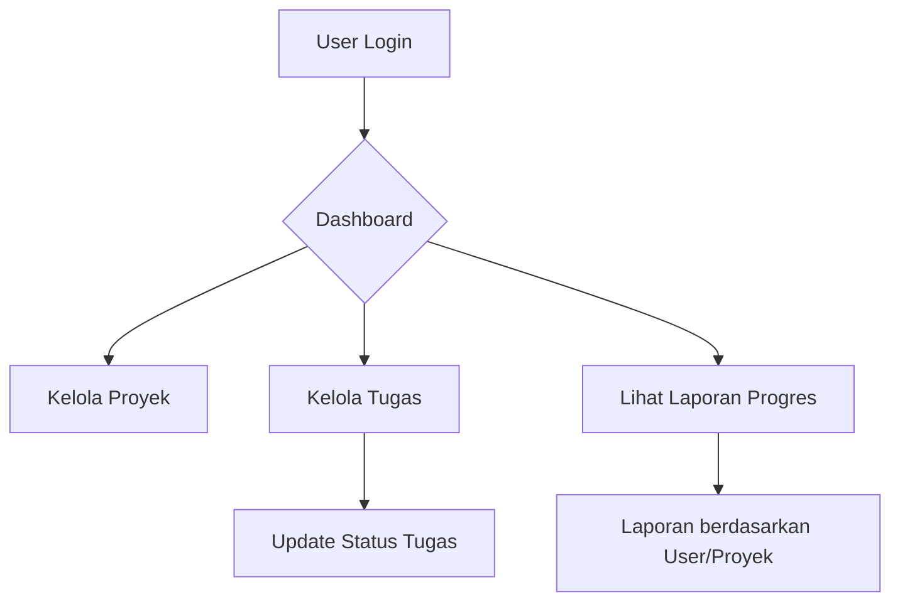

# 📄 Dokumentasi Teknis - Sistem Task Management

---

## 1. Pendahuluan

Sistem ini dibuat untuk mempermudah manajemen tugas di lingkungan internal perusahaan. Sistem mendukung:

- Manajemen Proyek dan Tugas.
- Pelaporan progres tugas.
- Role-Based Access Control menggunakan **Filament Shield**.
- Sistem berbasis web, menggunakan **Laravel 11** dan **Filament Admin Panel**.

---

## 2. Spesifikasi Teknologi

| Komponen           | Teknologi       |
| ------------------ | --------------- |
| Backend            | Laravel 11      |
| Admin Panel        | Filament PHP    |
| Database           | MySQL 8+        |
| Role Management    | Filament Shield |
| Webserver          | Apache / Nginx  |
| Bahasa Pemrograman | PHP 8.2+        |

---

## 3. Panduan Instalasi dan Setup Lokal

### 3.1. Clone Repository

```bash
git clone https://github.com/nama-repo/task-management.git
cd task-management
```

### 3.2. Instalasi Dependency

```bash
composer install
npm install && npm run build
```

### 3.3. Setup Environment

Copy file `.env.example` ke `.env`

```bash
cp .env.example .env
```

Kemudian ubah konfigurasi database sesuai lokal:

```dotenv
DB_DATABASE=task_management
DB_USERNAME=root
DB_PASSWORD=
```

### 3.4. Generate Key dan Migrate Database

```bash
php artisan key:generate
php artisan migrate --seed
```

### 3.5. Jalankan Server Lokal

```bash
php artisan serve
```

Akses Admin Panel:

```
http://localhost:8000/admin
```

Login menggunakan admin default:

- **Email:** [admin@gmail.com]
- **Password:** 123456

Login menggunakan user default:

- **Email:** [sasa@gmail.com]
- **Password:** 123456

(atau buat user baru via command `php artisan make:filament-user`)

---

## 4. Struktur Database (ERD)

**Entity Relationship Diagram (ERD):**

```
[users]
- id (PK)
- name
- email
- password
- ...

[projects]
- id (PK)
- name
- description
- created_at
- updated_at

[tasks]
- id (PK)
- project_id (FK)
- user_id (FK)
- title
- description
- status (enum: 'To Do', 'In Progress', 'Done')
- deadline
- created_at
- updated_at
```

**Relasi:**

- 1 **Project** → banyak **Task**
- 1 **User** → banyak **Task**

---

## 5. Alur Proses Sistem (Flowchart)



**Penjelasan:**

- User login ke sistem.
- User dapat membuat proyek dan tugas.
- Tugas dapat diubah statusnya (`To Do`, `In Progress`, `Done`).
- User dapat melihat laporan progres per user atau proyek.

---

## 6. Fitur Utama

### 6.1. Manajemen Proyek

- CRUD (Create, Read, Update, Delete) proyek.
- Setiap proyek bisa memiliki banyak tugas.

### 6.2. Manajemen Tugas

- Setiap tugas memiliki:
  - Nama tugas
  - Deskripsi
  - Deadline
  - Status (`To Do`, `In Progress`, `Done`)
  - Assigned user
- Filter tugas berdasarkan status atau user.

### 6.3. Pelaporan

- Menampilkan jumlah tugas berdasarkan status:
  - Per proyek
  - Per user
- Visualisasi dalam bentuk tabel dan summary card.

### 6.4. Hak Akses Pengguna

- **Admin**:
  - Akses penuh ke semua data.
- **Staff**:
  - Hanya dapat melihat/mengelola tugas yang ditugaskan ke dirinya.

Role Management menggunakan plugin **Filament Shield**.

---

## 7. Hak Akses dan Role (RBAC)

| Role  | Akses                                                 |
| ----- | ----------------------------------------------------- |
| Admin | Semua fitur: Project, Task, User Management, Laporan  |
| Staff | Hanya Task Management: lihat dan update tugas sendiri |

Manajemen perizinan dilakukan melalui Filament Shield dan bisa diatur granular per Resource.

---

## 8. Testing

- Pengujian dilakukan dengan akun **Admin** dan **Staff**.
- Test Case mencakup:
  - Login / Logout
  - Create / Edit / Delete Project
  - Create / Edit / Delete Task
  - Ubah status tugas
  - Lihat laporan
  - Cek pembatasan akses berdasarkan role

---

## 9. Deployment Notes

- Gunakan VPS/Hosting dengan support PHP 8.2+ dan MySQL 8+.
- Pastikan folder `storage/` dan `bootstrap/cache/` memiliki permission write.
- Set `.env` sesuai environment production (termasuk setting mail jika perlu notifikasi email).

---

# 📓 Penutup

Sistem ini dikembangkan dengan fokus pada kesederhanaan, skalabilitas, dan kemudahan penggunaan.
Dengan menggunakan **Filament Admin** dan **Filament Shield**, pengelolaan backend menjadi lebih cepat dan aman.
